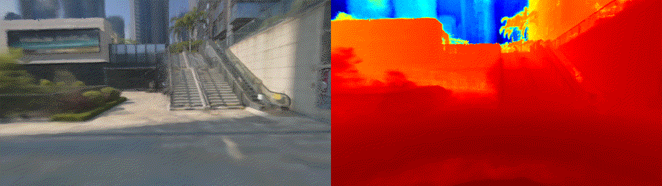

# nerf_pl

Unofficial implementation of [NeRF-W](https://nerf-w.github.io/) (NeRF in the wild) using pytorch ([pytorch-lightning](https://github.com/PyTorchLightning/pytorch-lightning)). I try to reproduce (some of) the results on the lego dataset (Section D). Training on [Phototourism real images](https://github.com/ubc-vision/image-matching-benchmark) (as the main content of the paper) has also passed. Please read the following sections for the results.

The code is largely based on NeRF implementation (see master or dev branch), the main difference is the model structure and the rendering process, which can be found in the two files under `models/`.

# :computer: Installation

## Hardware

* OS: Ubuntu 18.04
* NVIDIA GPU with **CUDA>=10.2** (tested with 1 RTX2080Ti)

remote server
```
ssh -p 22 yeliu@cpu001.corp.deepmirror.com
cd /mnt/nas/share-map/experiment/liuye/dev/nerf_pl
```

## Software

* Python>=3.6 (installation via [anaconda](https://www.anaconda.com/distribution/) is recommended.
```
conda create -n nerf_pl python=3.6
conda activate nerf_pl
```

* Python libraries
```
pip install -r artifacts/requirements.txt
```

# :key: Training

#### Update: There is a [difference](https://github.com/kwea123/nerf_pl/issues/130) between the paper: I didn't add the appearance embedding in the coarse model while it should. Please change [this line](https://github.com/kwea123/nerf_pl/blob/nerfw/models/nerf.py#L65) to `self.encode_appearance = encode_appearance` to align with the paper.

## Blender

<details>
  <summary>Steps</summary>

### Data download

Download `nerf_synthetic.zip` from [here](https://drive.google.com/drive/folders/128yBriW1IG_3NJ5Rp7APSTZsJqdJdfc1)

### Training model

Base:
```
python train.py \
   --dataset_name blender \
   --root_dir ./data/nerf_synthetic/lego \
   --N_importance 64 --img_wh 400 400 --noise_std 0 \
   --num_epochs 20 --batch_size 1024 \
   --optimizer adam --lr 5e-4 --lr_scheduler cosine \
   --exp_name exp
```

Add `--encode_a` for appearance embedding, `--encode_t` for transient embedding.
Add `--data_perturb color occ` to perturb the dataset.

See [opt.py](opt.py) for all configurations.

</details>

## Phototourism dataset

<details>
  <summary>Steps</summary>

### Data download

Download the scenes you want from [here](https://www.cs.ubc.ca/~kmyi/imw2020/data.html) (train/test splits are only provided for "Brandenburg Gate", "Sacre Coeur" and "Trevi Fountain", if you want to train on other scenes, you need to clean the data (Section C) and split the data by yourself)

Download the train/test split from the "Additional links" [here](https://nerf-w.github.io/) and put under each scene's folder (the **same level** as the "dense" folder)

(Optional but **highly** recommended) Run `python prepare_phototourism.py --root_dir $ROOT_DIR --img_downscale {an integer, e.g. 2 means half the image sizes}` to prepare the training data and save to disk first, if you want to run multiple experiments or run on multiple gpus. This will **largely** reduce the data preparation step before training.

### Training model

Run (example)

```
SESSION_NAME=20220823T175708+0800_xvnxa_xvnxa004_jmwdemo2
python prepare_phototourism.py --root_dir ./data/${SESSION_NAME} --img_downscale 8

python train.py \
  --root_dir ./data/${SESSION_NAME} --dataset_name phototourism \
  --img_downscale 8 --use_cache --N_importance 64 --N_samples 64 \
  --encode_a --encode_t --beta_min 0.03 --N_vocab 1500 \
  --num_epochs 20 --batch_size 1024 \
  --optimizer adam --lr 5e-4 --lr_scheduler cosine \
  --exp_name ${SESSION_NAME}
```

`--encode_a` and `--encode_t` options are both required to maximize NeRF-W performance.

`--N_vocab` should be set to an integer larger than the number of images (dependent on different scenes). For example, "brandenburg_gate" has in total 1363 images (under `dense/images/`), so any number larger than 1363 works (no need to set to exactly the same number). **Attention!** If you forget to set this number, or it is set smaller than the number of images, the program will yield `RuntimeError: CUDA error: device-side assert triggered` (which comes from `torch.nn.Embedding`).



</details>

## Pretrained models and logs
Download the pretrained models and training logs in [release](https://github.com/kwea123/nerf_pl/releases).

# :mag_right: Testing

Use [eval.py](eval.py) to create the whole sequence of moving views.
It will create folder `results/{dataset_name}/{scene_name}` and run inference on all test data, finally create a gif out of them.

[See original repo](https://github.com/kwea123/nerf_pl/tree/nerfw)

# :warning: Notes on differences with the paper

*  Network structure ([nerf.py](models/nerf.py)):
    *  My base MLP uses 8 layers of 256 units as the original NeRF, while NeRF-W uses **512** units each.
    *  The static rgb head uses **1** layer as the original NeRF, while NeRF-W uses **4** layers. Empirically I found more layers to overfit when there is data perturbation, as it tends to explain the color change by the view change as well.
    *  I use **softplus** activation for sigma (reason explained [here](https://github.com/bmild/nerf/issues/29#issuecomment-765335765)) while NeRF-W uses **relu**.
    *  I apply `+beta_min` all the way at the end of compositing all raw betas (see `results['beta']` in [rendering.py](models/rendering.py)). The paper adds `beta_min` to raw betas first then composite them. I think my implementation is the correct way because initially the network outputs low sigmas, in which case the composited beta (if `beta_min` is added first) will be low too. Therefore not only values lower than `beta_min` will be output, but sometimes the composited beta will be *zero* if all sigmas are zeros, which causes problem in loss computation (division by zero). I'm not totally sure about this part, if anyone finds a better implementation please tell me.

*  Training hyperparameters
    *  I find larger (but not too large) `beta_min` achieves better result, so my default `beta_min` is `0.1` instead of `0.03` in the paper.
    *  I add 3 to `beta_loss` (equation 13) to make it positive empirically.
    *  When there is no transient head (NeRF-A), the loss is the average MSE error of coarse and fine models (not specified in the paper).
    *  Other hyperparameters differ quite a lot from the paper (although many are not specified, they say that they use grid search to find the best). Please check each pretrained models in the release.

*  Phototourism evaluation
    *  To evaluate the results on the testing set, they train on the left half of the image and evaluate on the right half (to train the embedding of the test images). I didn't perform this additional training, I only evaluated on the training images. It should be easy to implement this.
